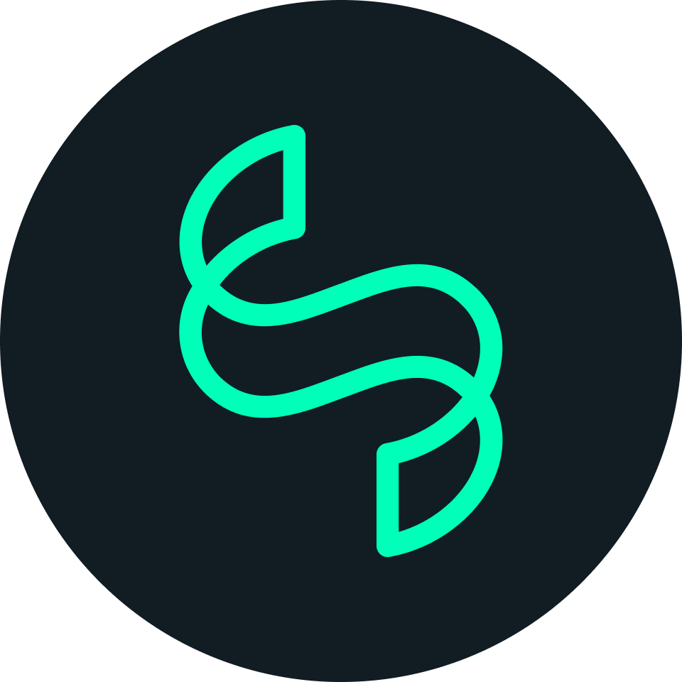
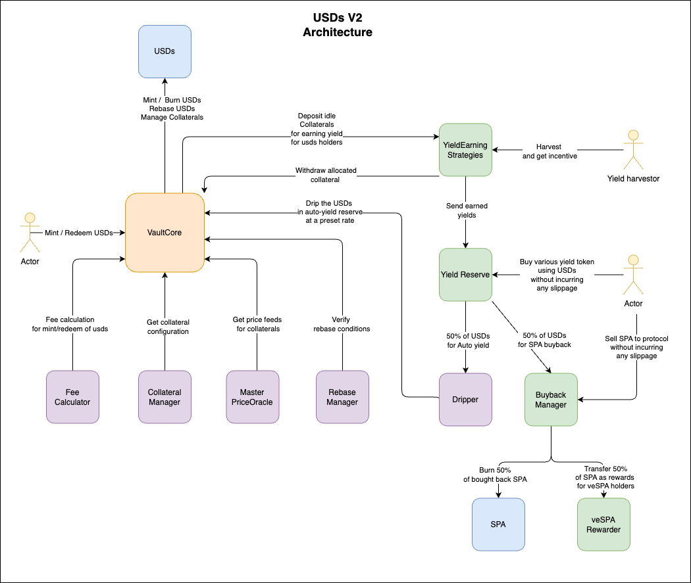

# <p align="center" style="font-size:50px">  </t> <u>Sperax USDs Protocol</u>  </p>



## About:
Sperax USD protocol mints USDs, a 100% collateralized stablecoin. USDs is backed by on-chain collateral and generates organic yield for its holders. USDs is the premier trading pair on Arbitrum.

## Description:
This repository contains the smart contracts and configurations for USDs protocol.
The project uses foundry framework for compiling, developing and testing contracts and brownie for deployments and scripting.


## Project Summary:
* [Summary](/docs/src/SUMMARY.md)

## Project Setup:
* [Install Foundry](https://book.getfoundry.sh/getting-started/installation)
* [Install Brownie](https://eth-brownie.readthedocs.io/en/stable/install.html)
* Run command ```$ npm ci```

## Licensing
All the contracts developed by Sperax protocol are licensed under `MIT` (as indicated in its SPDX header), see [LICENSE](./LICENSE)

## Connect with the community
[Website](https://sperax.io/) \
[Discord](https://discord.com/invite/cFdcvj9jMm) \
[Twitter](https://twitter.com/SperaxUSD) \
[Forum](https://forum.sperax.io/)
